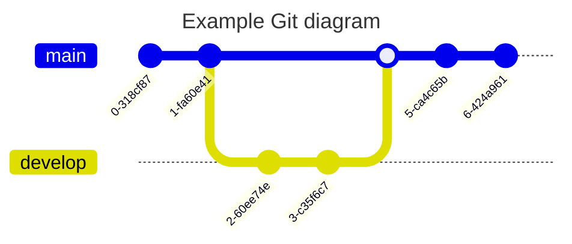

# mermaid notation

このコンテンツはHTML変換のテスト用に作成しました

---

> 参考URL：https://note.com/_kikiyo_/n/n67ca638d8c5c

---

---

---

> 参考URL：https://note.com/_kikiyo_/n/n67ca638d8c5c

### Chart

---

---

---
### excludes

---

### Gitgraph Diagrams

### Diagrams

---

^C

